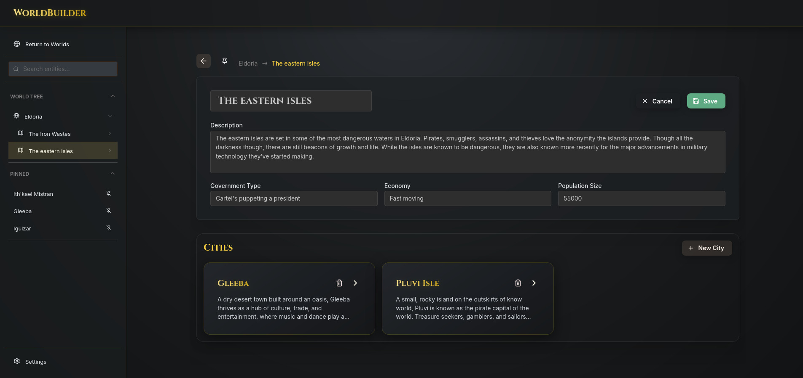

# WorldBuilderWeb

Build rich D&D worlds with a modern full-stack editor for locations, NPCs, factions, parties, and inventories.



## What this project is

WorldBuilderWeb is a worldbuilding workspace designed around a hierarchical model:

`World → Country → City → POI → NPC`

The app includes:

- A polished React workspace UI for browsing and editing your world.
- A Fastify + Prisma backend for persistent API-driven mode.
- A mock/local mode for front-end-only workflows.
- Optional AI-assisted generation for POIs, NPCs, and inventory.
- NPC chat — roleplay conversations with NPCs using full world context, with sessions automatically summarised into persistent diary-entry memories.

## Tech stack

- **Frontend:** React, TypeScript, Vite, Mantine
- **Backend:** Fastify, TypeScript, Prisma
- **Database:** MySQL

## Quick start

### 1) Clone and install

```bash
git clone <your-repo-url>
cd WorldBuilderWeb

cd backend && npm install
cd ../frontend && npm install
```

### 2) Configure environment variables

Backend (`backend/.env`):

```env
DATABASE_URL=mysql://<user>:<password>@localhost:3306/worldbuilder
PORT=3001
CORS_ORIGIN=http://localhost:5173
LOG_LEVEL=info
NODE_ENV=development
```

Frontend (`frontend/.env`):

```env
VITE_USE_API=true
VITE_API_URL=http://localhost:3001
# optional
VITE_OPENAI_API_KEY=
```

### 3) Initialize database (API mode)

```bash
cd backend
npm run db:generate
npm run db:migrate
```

### 4) Run the app

Backend:

```bash
cd backend
npm run dev
```

Frontend:

```bash
cd frontend
npm run dev
```

Open the frontend at `http://localhost:5173`.

## Run modes

- **API mode** (`VITE_USE_API=true`): frontend calls the Fastify backend.
- **Mock mode** (`VITE_USE_API=false`): frontend uses localStorage/in-memory data (no backend required).

## Documentation

- **Technical overview:** [overview/technical-overview.md](overview/technical-overview.md)
- Backend architecture: [overview/backend-architecture.md](overview/backend-architecture.md)
- Frontend architecture and data flow: [overview/frontend-data-flow.md](overview/frontend-data-flow.md)
- Database access: [overview/database-access.md](overview/database-access.md)
- Generative AI integration: [overview/generative-ai.md](overview/generative-ai.md)

## Notes

- Current login/session behavior is frontend state only (`AuthContext`) and does not yet enforce backend API auth.
- This repository currently uses `npm` scripts in both `frontend/` and `backend/`.
